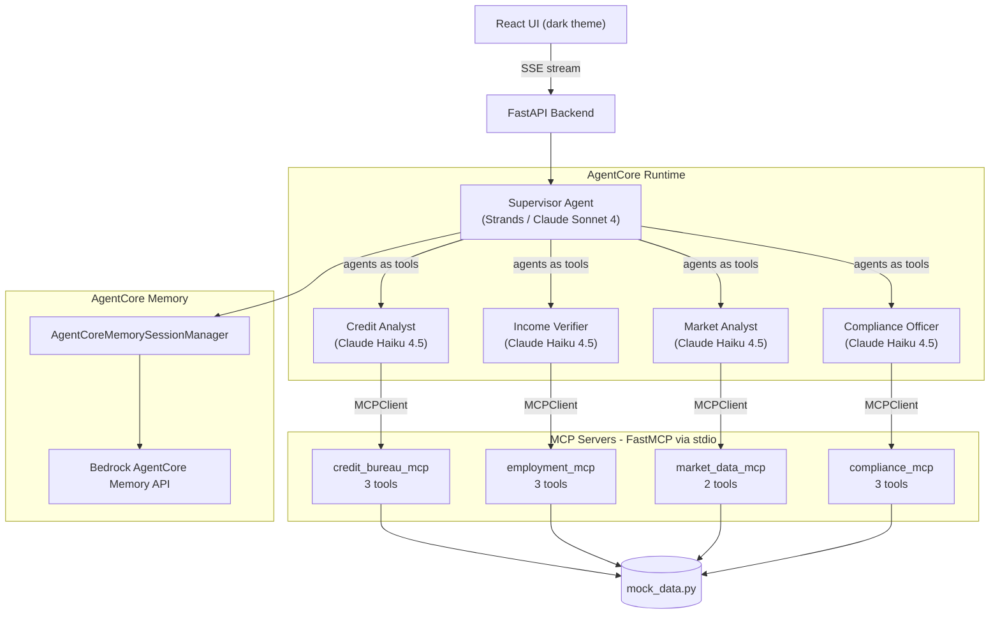
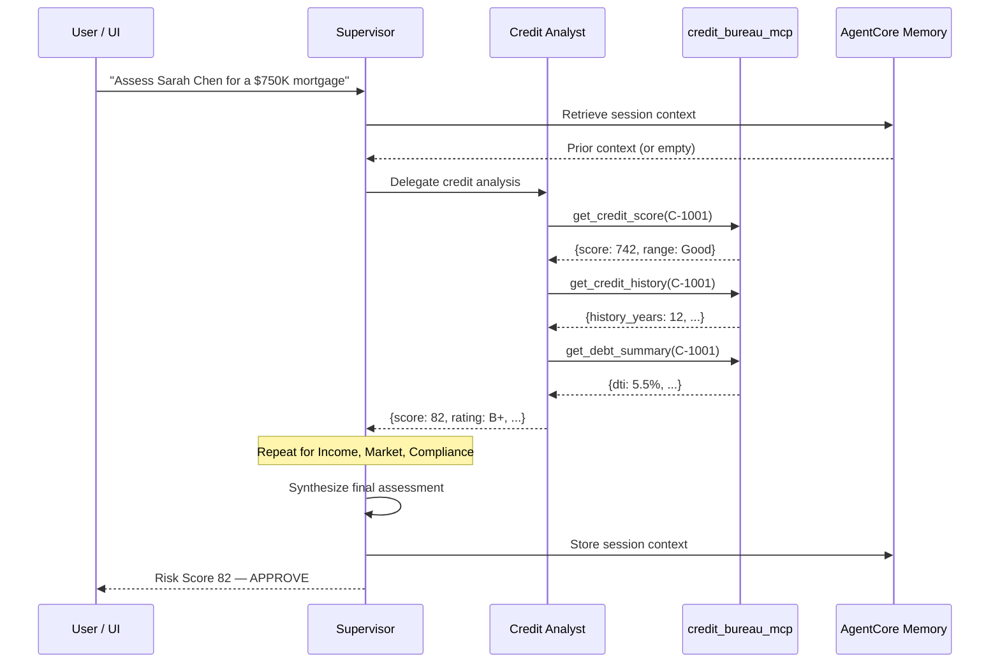

# AgentCore Multi-Agent Financial Risk Assessment

A demo showing **Amazon Bedrock AgentCore** capabilities through a financial risk assessment use case:

- **AgentCore Runtime** -- 4 specialist Strands agents + 1 supervisor, each in its own runtime context
- **AgentCore Memory** -- Conversation persistence across assessment sessions via AgentCore Memory SDK
- **MCP Tool Use** -- Real FastMCP servers (credit bureau, employment, market data, compliance screening) consumed via `MCPClient`

## Architecture



## Data flow (single assessment)



## Quick start (local -- mock mode)

No AWS credentials needed. Uses pre-built responses for instant demo:

```bash
make install

# Terminal 1
make mock

# Terminal 2
cd frontend && npm run dev
```

Open http://localhost:5173

## Real mode (Strands + Bedrock + MCP + Memory)

Requires AWS credentials with Bedrock model access:

```bash
# 1. Configure AWS
export AWS_REGION=us-east-1
aws configure  # or use SSO, profiles, etc.

# 2. (Optional) Create AgentCore Memory resource
make setup-memory
export AGENTCORE_MEMORY_ID=<id from output>

# 3. Run with real agents
make real

# 4. Frontend (separate terminal)
cd frontend && npm run dev
```

## Deploy to AWS (CDK)

For deploying infrastructure to a staff account:

```bash
# 1. Bootstrap CDK (first time only)
cd infra && npx cdk bootstrap

# 2. Deploy IAM roles, ECR repos, SSM params
make infra-deploy

# 3. Build and push agent container
cd backend
docker build -t agentcore-risk-backend .
# Tag and push to ECR (URI from SSM /agentcore-risk/supervisor/ecr-uri)
```

## Project structure

```
├── backend/
│   ├── server.py              # FastAPI + SSE streaming
│   ├── orchestrator.py        # Multi-agent orchestration (mock + real paths)
│   ├── mock_data.py           # Realistic financial data
│   ├── agents/                # Strands agent definitions
│   │   ├── credit_analyst.py  #   → credit_bureau_mcp
│   │   ├── income_verifier.py #   → employment_verification_mcp
│   │   ├── market_analyst.py  #   → market_data_mcp
│   │   └── compliance_officer.py  → compliance_screening_mcp
│   ├── mcp_servers/           # Real FastMCP servers (stdio transport)
│   │   ├── credit_bureau.py
│   │   ├── employment.py
│   │   ├── market_data.py
│   │   └── compliance.py
│   ├── requirements.txt
│   └── Dockerfile
├── frontend/                  # React + Tailwind dark-theme UI
│   └── src/
│       ├── App.tsx
│       └── components/
│           ├── ChatPanel.tsx
│           ├── AgentPanel.tsx
│           └── RiskDashboard.tsx
├── infra/                     # CDK infrastructure
│   ├── lib/agentcore-risk-stack.ts
│   └── bin/app.ts
├── scripts/
│   └── setup-agentcore-memory.py
├── docs/
│   └── DEMO-SCRIPT.md         # Talk script and demo walkthrough
├── Makefile
└── README.md
```

## Environment variables

| Variable | Default | Description |
|----------|---------|-------------|
| `MOCK_MODE` | `true` | `true` = simulated agents, `false` = real Strands + Bedrock |
| `MODEL_ID` | `us.anthropic.claude-sonnet-4-20250514-v1:0` | Supervisor model |
| `HAIKU_MODEL_ID` | `us.anthropic.claude-haiku-4-5-20250501-v1:0` | Sub-agent model |
| `AWS_REGION` | `us-east-1` | AWS region for Bedrock + Memory |
| `AGENTCORE_MEMORY_ID` | _(empty)_ | AgentCore Memory resource ID (from setup script) |

## What's real

| Component | Mock mode | Real mode |
|-----------|-----------|-----------|
| Agents | Simulated delays + pre-built responses | Strands SDK agents calling Bedrock |
| MCP Tools | Dict lookups returning mock data | Real FastMCP servers over stdio |
| Memory | Python dict (`MEMORY_STORE`) | AgentCore Memory API + local fallback |
| LLM calls | None | Claude Haiku 4.5 (sub-agents) + Sonnet 4 (supervisor) |
